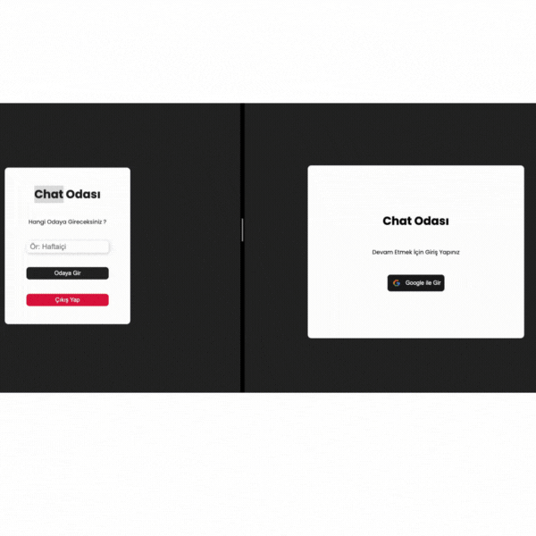

## Chat-App

This project aims to create a simple chat application using Firebase. Firebase provides features such as real-time database and authentication, enabling you to build fast and reliable chat applications.

### Usage

- Upon launching the application, users should log in via Firebase authentication.
- After logging in, users can join chat rooms, send messages, and view messages from other users.
- Thanks to real-time communication, new messages are instantly delivered to other users.

### For live project

- https://chat-app-fire-base.vercel.app/

### Project gif

##  Designed by <a href="https://www.linkedin.com/in/h%C3%BCseyin-aslan-128519203/" target="_blank">Hüseyin ASLAN</a> 
